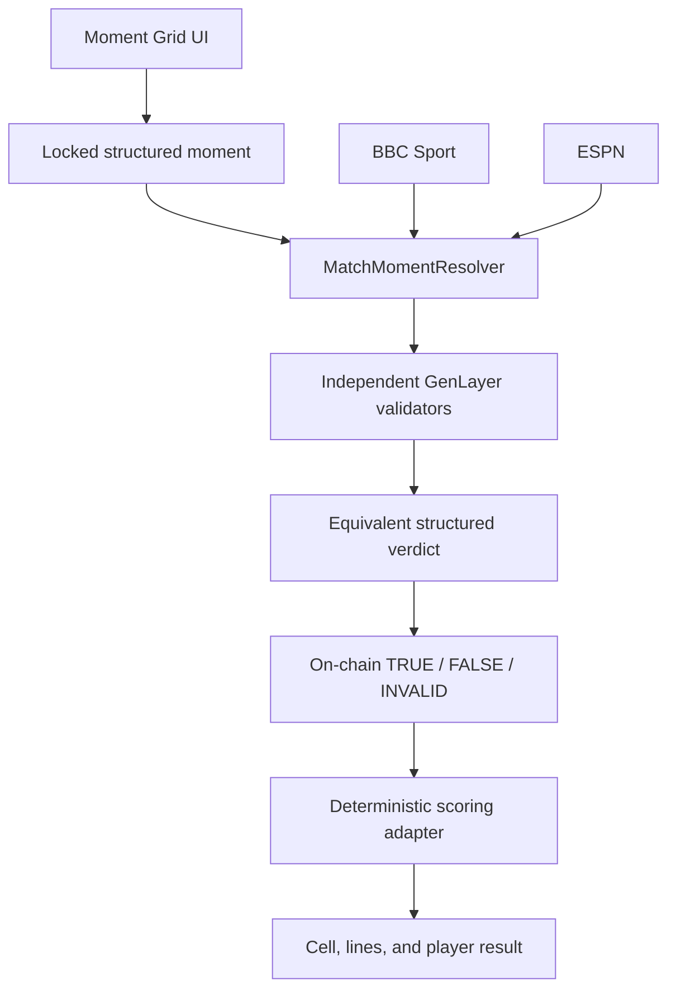

# Moment Grid

**A football prediction game where granular match moments are adjudicated on-chain through GenLayer validator consensus.**

## The Problem

Football games can settle final scores from ordinary feeds, but granular moments—who scored first, whether both teams scored, or whether a penalty was awarded inside a minute window—often live in changing, unstructured match reports. A single keeper interpreting those reports becomes a trusted oracle.

## Why GenLayer

Moment Grid uses a Python Intelligent Contract, `MatchMomentResolver`, where GenLayer validators independently fetch public match evidence, extract constrained facts, and agree on the stable decision fields. The accepted `TRUE`, `FALSE`, or retryable `INVALID` result is stored on-chain before deterministic grid scoring consumes it.

GenLayer is the adjudication authority, not a cosmetic AI call. The frontend cannot submit the answer, and the LLM never calculates grid lines.

## How Moment Grid Works

```text
Player chooses a 3×3 prediction grid
                 ↓
Predictions lock before resolution
                 ↓
Public BBC / ESPN match evidence
                 ↓
MatchMomentResolver validators independently evaluate facts
                 ↓
GenLayer consensus: TRUE / FALSE / INVALID
                 ↓
Immutable on-chain resolution
                 ↓
Pure TypeScript cell + line scoring
                 ↓
Won / Lost / Unable to Resolve
```

The existing grid has three time columns (0–30′, 30–60′, 60–90+′) and Common, Medium, and Rare rows. Rows, columns, and diagonals form eight possible completed lines.

## Intelligent Contract

[`contracts/match_moment_resolver.py`](contracts/match_moment_resolver.py) is a reusable football-resolution primitive independent of Moment Grid. It supports:

- `HOME_TEAM_SCORES_FIRST`
- `BOTH_TEAMS_SCORE_FULL_TIME`
- `PENALTY_AWARDED` with an explicit half-open minute range

The owner may register immutable match criteria and approved evidence URLs. Anyone may request resolution. Validators independently repeat the evidence task, while deterministic code applies finality rules and mutates state only after consensus.

Standalone architecture, safety properties, and integration guidance are in [`contracts/README.md`](contracts/README.md).

## On-chain Game Economy

The next contract layer is now implemented locally:

- [`contracts/match_round_resolver.py`](contracts/match_round_resolver.py) resolves all 27 supported moments into three validator-agreed window bitmaps;
- [`contracts/moment_grid_game.py`](contracts/moment_grid_game.py) accepts a payable grid entry of at least 10 GEN, applies rarity-weighted nine-pool accounting, settles only from the round resolver, scores the packed grid, and supports pull-based GEN claims or full timeout refunds;
- 90% of every stake backs the nine regular pools, 5% funds the rolling jackpot, and 5% becomes protocol revenue only after successful settlement;
- a jackpot grid must complete at least one horizontal row and at least one diagonal. Qualifiers share that round's jackpot pro rata by gross stake; otherwise it rolls into the next round.

The complete trust boundary and payout rules are documented in [`docs/ONCHAIN_GAME.md`](docs/ONCHAIN_GAME.md). These contracts are intended for persistent Testnet Bradbury; the existing Studionet resolver remains the live reviewer proof.

The weighted-pool game is deployed on Testnet Bradbury at
`0xb0D73f47583617F0f06924f24D47137BEfEa4708`. Its accepted deployment and
live 10 GEN allocation check are recorded in
[`deployments/genlayer/bradbury.json`](deployments/genlayer/bradbury.json).

## Live GenLayer Proof

The submission-grade contract is deployed from the durable encrypted developer account and holds representative TRUE/FALSE records from live validator consensus:

| Item | Value |
| --- | --- |
| Public live demo | [moment-grid-genlayer.vercel.app](https://moment-grid-genlayer.vercel.app) |
| Network | Studionet · chain 61999 |
| Durable contract | `0x3a87Ee9a47f6B1d9d2298166a4a7cA4907780dd9` |
| Durable deployment transaction | `0x60024d7204de5c7c43be7982ba5cb1b7f074fb27467d479d86760d2a185e638b` |
| Verified owner | `0xdB433ff614bDD1ecE21Aa97221C3E0a7ecf79c92` |
| TRUE transaction | `0x647cb97c7363c542972dc4e35b525cbd67cdd8bb8e4dfe55b8626b139f64eee4` |
| FALSE transaction | `0xec06d204c260028a6889fe2a0e6885f02ee1084673111e78451050aaf8a1eb02` |
| Consensus | `MAJORITY_AGREE`, successful execution |
| Evidence | BBC Sport + ESPN |

The TRUE record stores `HOME_FIRST / FINAL / 18′`. The FALSE record stores `NO_PENALTY_IN_WINDOW / FINAL`. Exact metadata is in [`deployments/genlayer/studionet.json`](deployments/genlayer/studionet.json).

The deployment manifest preserves both the durable submission instance and the earlier immutable Phase 2 proof instance.

## Architecture



Responsibility boundaries are described in [`docs/ARCHITECTURE.md`](docs/ARCHITECTURE.md).

## Reviewer Demo

Open the public [`/genlayer`](https://moment-grid-genlayer.vercel.app/genlayer) reviewer route. For local development, run the web app and open [`/genlayer`](http://localhost:3003/genlayer). The route reads actual configured contract state and shows:

- match and immutable criterion;
- settlement lifecycle and consensus state;
- TRUE, FALSE, or retryable INVALID;
- evidence summary and source links;
- transaction identifier;
- deterministic Moment Grid cell impact;
- on-chain resolution history.

The normal game experience remains at [`/`](http://localhost:3003/).

## Running Locally

Requirements: Node 20+, pnpm 10, and Python 3.12+.

```bash
pnpm install
python -m venv .venv
# Activate .venv, then:
pip install -r requirements.txt

cp web/.env.example web/.env.local
pnpm --filter @moment-grid/scoring build
pnpm --filter web dev
```

Open `http://localhost:3003`. Settled records and the replay are readable without a wallet. Connect an injected wallet only when triggering a new permissionless resolution.

## Running Tests

```bash
# Intelligent Contract
genvm-lint check contracts/match_moment_resolver.py
pytest tests/direct -v
gltest tests/integration/test_deployed_studionet_resolver.py -v -s --network studionet

# TypeScript application
pnpm --filter @moment-grid/scoring test
pnpm --filter api test
pnpm --filter api typecheck
pnpm --filter api build
pnpm --filter web lint
pnpm --filter web typecheck
pnpm --filter web build
pnpm --filter web test:e2e
```

The Playwright suite mocks only the read API for deterministic TRUE/FALSE/INVALID UI coverage. Set `E2E_LIVE_GENLAYER=1` to enable the additional read-only Studionet browser test.

## GenLayer Development

- Fast contract logic uses Direct Mode mocks.
- Hosted Studionet tests real web access, LLM extraction, leader/validator agreement, and GenVM execution.
- Network selection is environment-driven and supports localnet, Studionet, and future Bradbury.
- Deployment accounts are encrypted CLI keystores; passwords and private keys are never committed.
- Use [`scripts/deploy-genlayer.ps1`](scripts/deploy-genlayer.ps1) from an interactive terminal for a durable-owner deployment.

See [`docs/STUDIONET_RUNBOOK.md`](docs/STUDIONET_RUNBOOK.md) and [`docs/GENLAYER_SOURCE_POLICY.md`](docs/GENLAYER_SOURCE_POLICY.md).

## Security / Trust Assumptions

- The contract owner is trusted only to register match identity, criteria, and allowlisted source URLs. Registered definitions cannot be replaced.
- Resolution is permissionless; callers cannot supply or alter evidence.
- V1 source governance is curated, not fully decentralized. BBC, ESPN, and TheSportsDB origins are code-allowlisted.
- At least two configured sources must be available. Missing identity, source disagreement, or insufficient finality produces retryable `INVALID` rather than a guess.
- Validators compare result, reason, match status, and decisive minute; evidence-summary prose is audit context.
- Studionet is a development network. A production deployment still needs durable governance, monitoring, and an explicit appeals policy.
- The application stores no private keys and accepts no caller-supplied verdicts.

## Submission Materials

- [GenLayer contribution drafts](docs/GENLAYER_SUBMISSION.md)
- [60–90 second demo script](docs/DEMO_SCRIPT.md)
- [Answer-free demo fixtures](fixtures/genlayer/)
- [Deployment record](deployments/genlayer/studionet.json)

No private keys, account passwords, or provider API keys belong in this repository.
